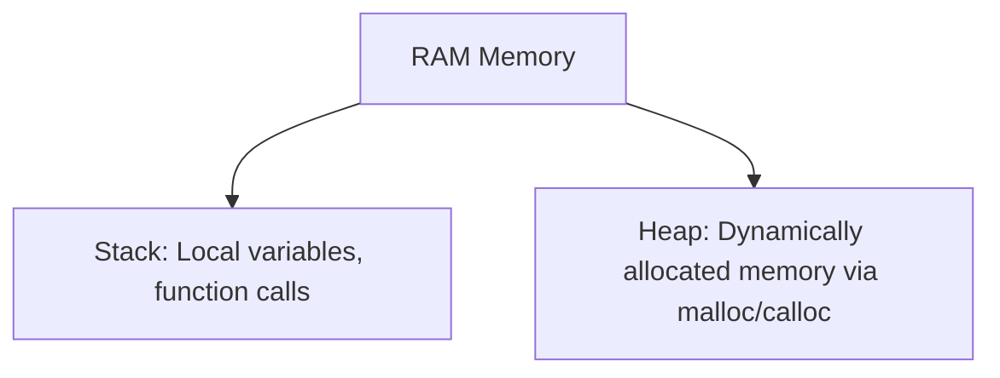
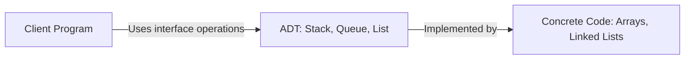
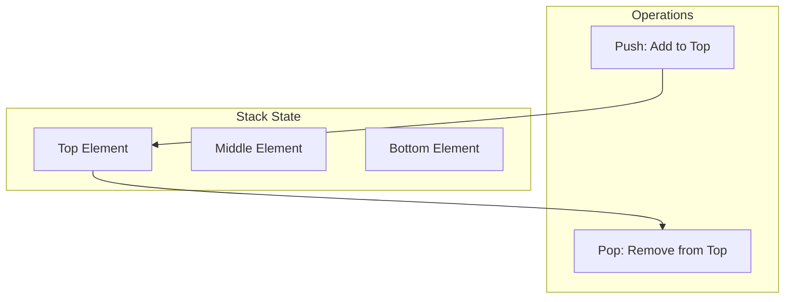
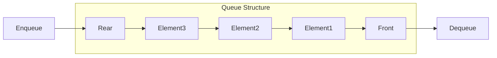

# C Programming & Data Structures: Core Concepts & Implementations

Welcome to the comprehensive guide to **C Programming and Data Structures**. This guide covers the essential building blocks of C, dynamic memory management, and step-by-step implementations of fundamental data structures.

---

## 1. C Basics for Data Structures

Before building data structures, you must master the fundamental concepts of pointers, structures, and dynamic memory management in C.

### 1.1 Pointers & Memory Addresses
A pointer is a variable that stores the memory address of another variable.

| Operator | Name | Description | Example |
| :--- | :--- | :--- | :--- |
| `&` | Address-of | Returns the memory address of a variable | `int *ptr = &var;` |
| `*` | Dereference | Accesses the value stored at the memory address | `int value = *ptr;` |

#### Pointer Basics Example
```c
#include <stdio.h>

int main() {
    int x = 10;
    int *p = &x; // p stores the address of x

    printf("Value of x: %d\n", x);
    printf("Address of x: %p\n", (void*)&x);
    printf("Value of p (address of x): %p\n", (void*)p);
    printf("Value pointed to by p (*p): %d\n", *p);

    *p = 20; // Modifying x via pointer
    printf("New value of x: %d\n", x);

    return 0;
}
```

> [!IMPORTANT]
> Always cast pointer addresses to `(void*)` when printing them using `%p` to ensure standard compliance across different compilers and architectures.

---

### 1.2 Structures (`struct`)
A structure is a user-defined data type that groups related variables of different types.

```c
#include <stdio.h>
#include <string.h>

// Definition of a structure
struct Student {
    char name[50];
    int id;
    float gpa;
};

int main() {
    struct Student s1;
    
    // Assigning values
    strcpy(s1.name, "Alice");
    s1.id = 101;
    s1.gpa = 3.85;

    // Pointer to structure
    struct Student *sPtr = &s1;

    // Accessing using dot (.) and arrow (->) operators
    printf("Name: %s\n", s1.name);
    printf("ID (via dot): %d\n", s1.id);
    printf("GPA (via arrow): %.2f\n", sPtr->gpa); // sPtr->gpa is equivalent to (*sPtr).gpa

    return 0;
}
```

---

### 1.3 Dynamic Memory Allocation
Dynamic memory allocation allows you to allocate memory during runtime from the **Heap**, rather than the **Stack**.



#### Functions in `<stdlib.h>`
1. **`malloc(size_t size)`**: Allocates raw memory of specified size. Contains garbage value.
2. **`calloc(size_t num, size_t size)`**: Allocates memory and initializes all bytes to zero.
3. **`realloc(void *ptr, size_t new_size)`**: Resizes previously allocated memory.
4. **`free(void *ptr)`**: Deallocates memory and returns it to the heap.

#### Safe Allocation Pattern
```c
#include <stdio.h>
#include <stdlib.h>

int main() {
    int n = 5;
    // 1. Allocate memory for 5 integers
    int *arr = (int*)malloc(n * sizeof(int));

    // 2. ALWAYS check if allocation was successful
    if (arr == NULL) {
        printf("Memory allocation failed!\n");
        return 1;
    }

    // 3. Initialize and use
    for (int i = 0; i < n; i++) {
        arr[i] = (i + 1) * 10;
    }

    // 4. Release memory and set pointer to NULL to avoid dangling pointers
    free(arr);
    arr = NULL;

    return 0;
}
```

> [!WARNING]
> **Dangling Pointer**: A pointer pointing to a memory location that has been freed. Always set pointers to `NULL` after calling `free(ptr)`.
> **Memory Leak**: Occurs when dynamically allocated memory is no longer referenced but has not been freed.

---

## 2. Abstract Data Types (ADT)

An **Abstract Data Type** is a mathematical model for data types where the data type is defined by its behavior (operations) from the user's point of view, rather than its implementation in code.



---

## 3. Arrays

Arrays are collections of elements of the same type stored in contiguous memory locations.

### Pros & Cons
- **Pros**: Constant time $O(1)$ random access to any element by index.
- **Cons**: Fixed size (for static arrays), costly insertions/deletions in the middle ($O(n)$ shifts).

---

## 4. Singly Linked Lists

A **Linked List** is a linear data structure where elements are not stored in contiguous memory locations. Instead, elements (nodes) are linked using pointers.

### Structure of a Node
```mermaid
graph LR
    node1[Node 1: Data | Next] --> node2[Node 2: Data | Next] --> node3[Node 3: Data | NULL]
```

```c
typedef struct Node {
    int data;
    struct Node* next;
} Node;
```

### Complete Linked List Implementation
```c
#include <stdio.h>
#include <stdlib.h>

typedef struct Node {
    int data;
    struct Node* next;
} Node;

// Create a new node
Node* createNode(int val) {
    Node* newNode = (Node*)malloc(sizeof(Node));
    if (newNode == NULL) {
        printf("Memory allocation failed!\n");
        exit(1);
    }
    newNode->data = val;
    newNode->next = NULL;
    return newNode;
}

// Insert at the head
void insertAtHead(Node** head, int val) {
    Node* newNode = createNode(val);
    newNode->next = *head;
    *head = newNode;
}

// Insert at the tail
void insertAtTail(Node** head, int val) {
    Node* newNode = createNode(val);
    if (*head == NULL) {
        *head = newNode;
        return;
    }
    Node* temp = *head;
    while (temp->next != NULL) {
        temp = temp->next;
    }
    temp->next = newNode;
}

// Delete by value
void deleteNode(Node** head, int key) {
    Node* temp = *head;
    Node* prev = NULL;

    // Case 1: Head contains key
    if (temp != NULL && temp->data == key) {
        *head = temp->next;
        free(temp);
        return;
    }

    // Case 2: Search for key
    while (temp != NULL && temp->data != key) {
        prev = temp;
        temp = temp->next;
    }

    // Key not found
    if (temp == NULL) {
        printf("Value %d not found in the list.\n", key);
        return;
    }

    // Unlink node
    prev->next = temp->next;
    free(temp);
}

// Print list
void printList(Node* head) {
    Node* temp = head;
    while (temp != NULL) {
        printf("%d -> ", temp->data);
        temp = temp->next;
    }
    printf("NULL\n");
}

// Free memory
void freeList(Node* head) {
    Node* temp;
    while (head != NULL) {
        temp = head;
        head = head->next;
        free(temp);
    }
}

int main() {
    Node* head = NULL;

    insertAtTail(&head, 10);
    insertAtTail(&head, 20);
    insertAtHead(&head, 5);
    insertAtTail(&head, 30);

    printf("Linked List: ");
    printList(head); // Output: 5 -> 10 -> 20 -> 30 -> NULL

    deleteNode(&head, 20);
    printf("After deleting 20: ");
    printList(head); // Output: 5 -> 10 -> 30 -> NULL

    freeList(head);
    head = NULL;
    return 0;
}
```

---

## 5. Stacks (LIFO - Last In, First Out)

A stack is a linear data structure that follows the Last In, First Out (LIFO) principle. The last element added is the first one to be removed.

### Stack Operations Visualized


### Stack Implementation using Dynamic Array
```c
#include <stdio.h>
#include <stdlib.h>
#include <stdbool.h>

typedef struct Stack {
    int top;
    unsigned capacity;
    int* array;
} Stack;

// Initialize stack
Stack* createStack(unsigned capacity) {
    Stack* stack = (Stack*)malloc(sizeof(Stack));
    stack->capacity = capacity;
    stack->top = -1;
    stack->array = (int*)malloc(stack->capacity * sizeof(int));
    return stack;
}

bool isFull(Stack* stack) {
    return stack->top == (int)stack->capacity - 1;
}

bool isEmpty(Stack* stack) {
    return stack->top == -1;
}

// Push to Stack
void push(Stack* stack, int item) {
    if (isFull(stack)) {
        printf("Stack Overflow!\n");
        return;
    }
    stack->array[++stack->top] = item;
    printf("%d pushed to stack\n", item);
}

// Pop from Stack
int pop(Stack* stack) {
    if (isEmpty(stack)) {
        printf("Stack Underflow!\n");
        return -1;
    }
    return stack->array[stack->top--];
}

// Peek top element
int peek(Stack* stack) {
    if (isEmpty(stack)) {
        return -1;
    }
    return stack->array[stack->top];
}

// Free memory
void freeStack(Stack* stack) {
    free(stack->array);
    free(stack);
}

int main() {
    Stack* stack = createStack(100);

    push(stack, 10);
    push(stack, 20);
    push(stack, 30);

    printf("Top element is %d\n", peek(stack));
    printf("%d popped from stack\n", pop(stack));
    printf("Top element after pop is %d\n", peek(stack));

    freeStack(stack);
    return 0;
}
```

---

## 6. Queues (FIFO - First In, First Out)

A queue is a linear data structure that follows the First In, First Out (FIFO) principle. Elements are inserted at the back (Rear) and removed from the front (Front).

### Queue Visualized


### Queue Implementation using Linked List
```c
#include <stdio.h>
#include <stdlib.h>
#include <stdbool.h>

typedef struct QNode {
    int key;
    struct QNode* next;
} QNode;

typedef struct Queue {
    QNode *front, *rear;
} Queue;

// Create new QNode
QNode* newNode(int k) {
    QNode* temp = (QNode*)malloc(sizeof(QNode));
    temp->key = k;
    temp->next = NULL;
    return temp;
}

// Create Queue
Queue* createQueue() {
    Queue* q = (Queue*)malloc(sizeof(Queue));
    q->front = q->rear = NULL;
    return q;
}

// Enqueue operation
void enqueue(Queue* q, int k) {
    QNode* temp = newNode(k);
    if (q->rear == NULL) {
        q->front = q->rear = temp;
        return;
    }
    q->rear->next = temp;
    q->rear = temp;
    printf("Enqueued: %d\n", k);
}

// Dequeue operation
int dequeue(Queue* q) {
    if (q->front == NULL) {
        printf("Queue is empty!\n");
        return -1;
    }
    QNode* temp = q->front;
    int val = temp->key;
    q->front = q->front->next;

    if (q->front == NULL) {
        q->rear = NULL;
    }
    free(temp);
    return val;
}

void freeQueue(Queue* q) {
    while (q->front != NULL) {
        QNode* temp = q->front;
        q->front = q->front->next;
        free(temp);
    }
    free(q);
}

int main() {
    Queue* q = createQueue();
    enqueue(q, 10);
    enqueue(q, 20);
    enqueue(q, 30);

    printf("Dequeued: %d\n", dequeue(q));
    printf("Dequeued: %d\n", dequeue(q));

    enqueue(q, 40);
    printf("Dequeued: %d\n", dequeue(q));
    printf("Dequeued: %d\n", dequeue(q));

    freeQueue(q);
    return 0;
}
```

---

## 7. Complexity Reference Chart

Here is a summary of the time complexities of standard operations across arrays, linked lists, stacks, and queues:

| Data Structure | Access | Search | Insertion | Deletion |
| :--- | :--- | :--- | :--- | :--- |
| **Array (Static/Dynamic)** | $O(1)$ | $O(n)$ | $O(n)$ | $O(n)$ |
| **Singly Linked List** | $O(n)$ | $O(n)$ | $O(1)$ | $O(1)$ |
| **Stack (LIFO)** | $O(n)$ | $O(n)$ | $O(1)$ | $O(1)$ |
| **Queue (FIFO)** | $O(n)$ | $O(n)$ | $O(1)$ | $O(1)$ |

> [!TIP]
> Stacks and Queues restrict access so that insertions and deletions always happen in $O(1)$ time at the endpoints, making them highly efficient for execution history, scheduling, and buffering tasks.
