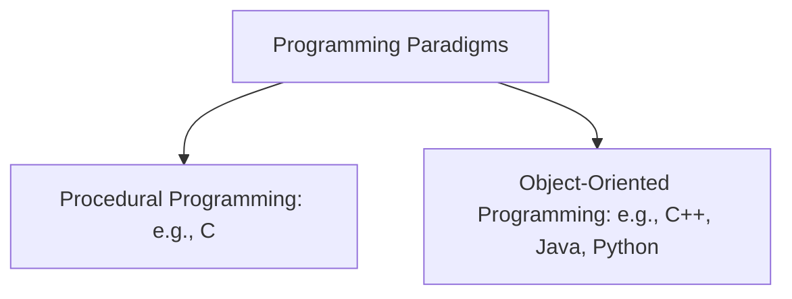
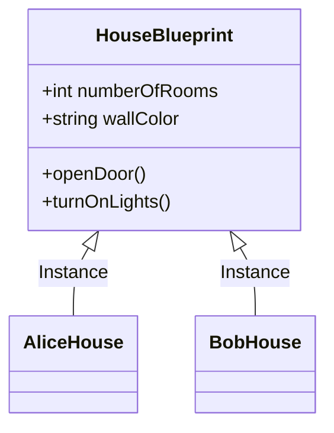
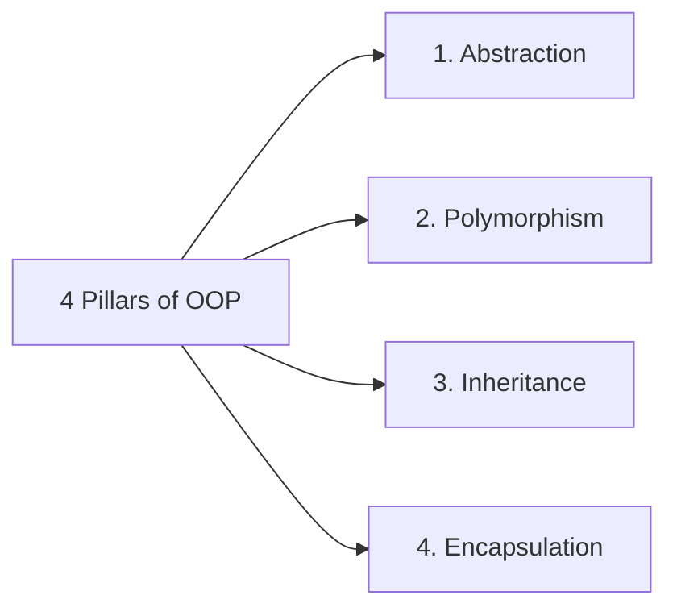

# Introduction to Programming Paradigms: OOP & C Basics

If you are brand new to programming, terms like **Procedural Programming**, **Object-Oriented Programming (OOP)**, and **Data Structures** can sound intimidating. 

This guide breaks down these concepts from the absolute beginning, explaining what OOP is, how it compares to C, and then teaching the foundational building blocks of C.

---

## 1. What is a Programming Paradigm?

A **programming paradigm** is a style, way, or methodology of writing computer code to solve problems. Different programming languages are designed around different paradigms.



### 1.1 Procedural Programming (The "C" Way)
In procedural programming, a program is written as a sequence of instructions or **functions** that tell the computer what to do step-by-step.
- It focuses on **procedures/functions** (actions) rather than data.
- Data and functions are separate.
- Perfect for system-level programming and simple calculations.

### 1.2 Object-Oriented Programming (OOP)
In OOP, a program is structured around **Objects** rather than functions. An object is a container that bundles both **data** (attributes) and **actions** (behaviors) together.
- It models the real world.
- Focuses on **objects/data** rather than logic.
- Perfect for large application development, game engines, and GUIs.

---

## 2. Understanding OOP (Object-Oriented Programming)

Let's learn OOP concepts without writing complex code.

### 2.1 Classes and Objects: The Blueprint & The House
- **Class (Blueprint)**: A template or plan for creating something. It defines what attributes and actions the entity will have, but doesn't exist physically.
- **Object (Instance)**: The actual physical thing created from the blueprint.



> **Real-World Analogy**:
> Think of a car manufacturer's design blueprint for a car model. The design blueprint is the **Class**. The physical car you drive on the road is an **Object** created from that blueprint.

---

### 2.2 The 4 Pillars of OOP
OOP is built on four core principles (often remembered as **A-P-I-E**):



#### 1. Abstraction (Hiding Complexity)
Showing only the essential features of an object and hiding the complex background details.
*   **Analogy**: When you drive a car, you push the gas pedal to accelerate. You do not need to know the physics of combustion or how the engine injects fuel. The complex details are *abstracted* away behind a simple pedal.

#### 2. Encapsulation (Data Hiding/Binding)
Grouping the data (variables) and the methods (functions) that operate on that data into a single unit (Class), and restricting direct access to some of the object's components.
*   **Analogy**: A capsule medicine pill. The actual powder medicine is enclosed inside the capsule shell. You cannot touch the powder directly; you must swallow the entire capsule. In code, this keeps variables safe from accidental modification.

#### 3. Inheritance (Reusability)
Allowing a new class to adopt the properties and behaviors of an existing class.
*   **Analogy**: A `Vehicle` class has properties like `speed` and `fuelCapacity`. A `Car` class and a `Truck` class can inherit these properties from `Vehicle` and then add their own unique properties (like `trunkSize` for `Car` or `towingCapacity` for `Truck`).

#### 4. Polymorphism (Many Forms)
The ability of different objects to respond to the same function call in their own unique way.
*   **Analogy**: The word **"Cut"**.
    *   To a **hair stylist**, it means cutting hair.
    *   To an **actor/director**, it means stop acting.
    *   To a **card dealer**, it means dividing the deck.
    *   One word (interface), different behaviors depending on who receives it.

---

## 3. Absolute Basics of C Programming

Now that you know how OOP differs from procedural coding, let's look at **C**, which is a **Procedural Language** (it does not have classes or built-in OOP features, but is the absolute best way to learn how computer memory works).

### 3.1 Structure of a C Program
Here is the simplest C program:

```c
#include <stdio.h> // Library for standard input and output

// The entry point where every C program starts executing
int main() {
    printf("Hello, World!\n"); // Prints text to the screen
    return 0; // Tells the operating system that the program finished successfully
}
```

---

### 3.2 Variables and Data Types
A variable is a container (memory location) for storing data. In C, you must specify what type of data the variable will hold.

| Data Type | Keyword | Size (Bytes) | Example | Format Specifier |
| :--- | :--- | :--- | :--- | :--- |
| Integer | `int` | 4 bytes | `int age = 20;` | `%d` |
| Floating Point | `float` | 4 bytes | `float gpa = 3.85;` | `%f` |
| Double Float | `double` | 8 bytes | `double pi = 3.14159265;`| `%lf` |
| Character | `char` | 1 byte | `char grade = 'A';` | `%c` |

#### Reading Input & Printing Output
```c
#include <stdio.h>

int main() {
    int age;
    printf("Enter your age: ");
    
    // Read input from user (& is used to find where 'age' variable is stored in memory)
    scanf("%d", &age);
    
    printf("You are %d years old.\n", age);
    return 0;
}
```

---

### 3.3 Decision Making (Conditionals)
Using decisions, we can instruct the computer to run different blocks of code depending on whether a condition is true or false.

```c
#include <stdio.h>

int main() {
    int score = 85;

    if (score >= 90) {
        printf("Grade: A\n");
    } else if (score >= 80) {
        printf("Grade: B\n");
    } else {
        printf("Grade: C or below\n");
    }

    return 0;
}
```

---

### 3.4 Loops (Repetitive Actions)
Loops allow you to run a block of code multiple times.

#### 1. The `for` Loop (Used when you know how many times to repeat)
```c
#include <stdio.h>

int main() {
    // Prints numbers 1 to 5
    for (int i = 1; i <= 5; i++) {
        printf("%d ", i);
    }
    printf("\n");
    return 0;
}
```

#### 2. The `while` Loop (Used when you want to repeat until a condition changes)
```c
#include <stdio.h>

int main() {
    int count = 1;
    while (count <= 5) {
        printf("%d ", count);
        count++; // Increment count
    }
    printf("\n");
    return 0;
}
```

---

### 3.5 Functions (Reusable Blocks of Code)
Instead of writing the same logic multiple times, you group it inside a function.

```c
#include <stdio.h>

// Function definition: Takes two integers and returns their sum
int addNumbers(int a, int b) {
    return a + b;
}

int main() {
    int sum = addNumbers(5, 7); // Calling the function
    printf("Sum is: %d\n", sum);
    return 0;
}
```

---

## 4. Quick Comparison: Procedural vs Object-Oriented

| Feature | Procedural (C) | Object-Oriented (C++, Java, Python) |
| :--- | :--- | :--- |
| **Approach** | Top-down (focus on functions). | Bottom-up (focus on objects). |
| **Core Entity** | Functions (Algorithms). | Objects (Data + Methods). |
| **Security** | Low (Data is openly accessible to functions). | High (Data encapsulation hides details). |
| **Real-world modeling** | Hard to map directly. | Very easy to map objects to real-world things. |
| **Code Reusability** | Limited (must copy/paste or write new functions). | High (uses Inheritance). |

> [!TIP]
> **Summary for Beginners**:
> - Start by writing **Procedural code in C** to learn variables, loops, functions, and memory.
> - Once comfortable, move to **OOP (like C++ or Python)** to learn classes, objects, and the 4 pillars.
> - Once you understand both, study **Data Structures** (how arrays, lists, stacks, and queues organize data under the hood).
