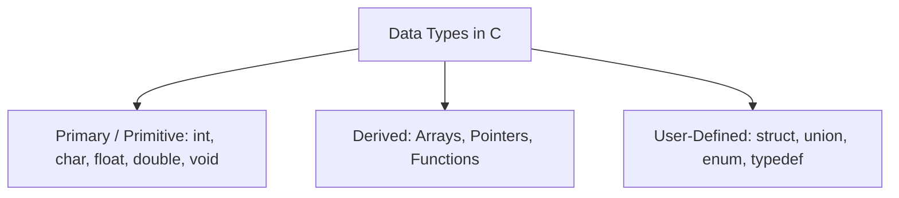
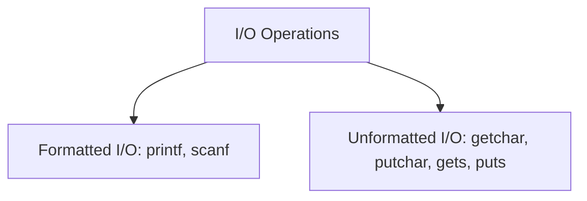

# Course: Data Structures Using C Programming (23CYUC101)
## UNIT - I: Introduction & C Basics (12 Hours)

---

## 1. Introduction to Problem Solving

Before writing code in C, a programmer must solve the logical problem on paper. Problem-solving is the systematic process of finding solutions to complex issues.

### 1.1 Steps in Problem Solving
1.  **Define the Problem**: Understand what needs to be solved (Inputs, Processes, and desired Outputs).
2.  **Analyze the Problem**: Determine the constraints, edge cases, and best approaches.
3.  **Design a Solution**: Write an **Algorithm**, draw a **Flowchart**, or write **Pseudocode**.
4.  **Implement (Coding)**: Write the solution in a programming language (like C).
5.  **Test & Debug**: Test the program with different inputs and fix errors.
6.  **Maintain**: Keep the software updated and optimized.

---

### 1.2 Algorithms
An **Algorithm** is a step-by-step finite set of instructions to solve a specific problem.

#### Key Characteristics of a Good Algorithm:
- **Input**: Must have 0 or more well-defined inputs.
- **Output**: Must produce at least 1 output.
- **Definiteness**: Each step must be clear and unambiguous.
- **Finiteness**: Must terminate after a finite number of steps.
- **Effectiveness**: Each step must be feasible and basic enough to be done with paper and pencil.

#### Example Algorithm: Find the Largest of Two Numbers
1. Start.
2. Read two numbers, `num1` and `num2`.
3. If `num1 > num2`, then print "`num1` is largest".
4. Else, print "`num2` is largest".
5. Stop.

---

### 1.3 Flowcharts
A **Flowchart** is a graphical/pictorial representation of an algorithm.

#### Common Flowchart Symbols:
| Symbol Shape | Name | Purpose |
| :--- | :--- | :--- |
| **Oval** | Start / End | Denotes the start or stop of the program |
| **Parallelogram** | Input / Output | Represents reading inputs or printing outputs |
| **Rectangle** | Process / Action | Represents arithmetic operations or variable assignments |
| **Diamond** | Decision | Represents conditional checks (e.g., Yes/No, True/False) |
| **Arrows** | Flow lines | Shows the sequence and direction of operations |

---

### 1.4 Pseudocode
**Pseudocode** is an informal, high-level description of a computer program written in plain English. It contains no language-specific syntax but mimics code structures.

#### Example Pseudocode: Calculate Factorial
```text
BEGIN
    READ number
    SET factorial = 1
    SET i = 1
    WHILE i <= number
        factorial = factorial * i
        i = i + 1
    ENDWHILE
    WRITE factorial
END
```

---

## 2. Overview of C Programming

C is a robust, general-purpose, structure-oriented programming language developed by **Dennis Ritchie** in **1972** at **AT&T Bell Laboratories**. It was created to write the UNIX Operating System.

### Key Features of C:
- **Middle-level language**: Combines the power of high-level languages with the speed and control of assembly language (low-level).
- **Structured & Modular**: Programs can be broken down into functions.
- **Case-Sensitive**: Lowercase and uppercase letters are treated differently (e.g., `value` and `Value` are distinct).
- **Extensible**: Supports rich standard libraries.

---

## 3. Structure of a C Program & Sample Program

Every C program follows a standard template.

### 3.1 Template of a C Program
1.  **Documentation Section**: Comments (lines ignored by compiler) explaining the code.
2.  **Link / Preprocessor Section**: Linking system libraries (e.g., `#include <stdio.h>`).
3.  **Definition Section**: Defining constants (e.g., `#define PI 3.1415`).
4.  **Global Declaration Section**: Variables accessible by all functions.
5.  **Main Function**: `int main()` where execution begins.
6.  **Sub-programs/Functions**: User-defined functions.

### 3.2 Sample Program: Adding Two Numbers
```c
/* 
   Author: Syllabus Notes
   Program: Add two numbers and display the result.
*/

#include <stdio.h> // Preprocessor directive to include standard I/O library

int main() {
    // Variable declarations
    int num1, num2, sum;

    // Output message
    printf("Enter first number: ");
    // Input statement
    scanf("%d", &num1);

    printf("Enter second number: ");
    scanf("%d", &num2);

    // Expression evaluation (Process)
    sum = num1 + num2;

    // Displaying output
    printf("The sum of %d and %d is: %d\n", num1, num2, sum);

    return 0; // Exit status to operating system
}
```

#### Detailed Breakdown of the Sample Program:
- **`#include <stdio.h>`**: Includes the header file for standard input and output functions like `printf` and `scanf`.
- **`int main()`**: The starting point of execution. `int` indicates the function returns an integer to the operating system.
- **`{ ... }`**: Curly braces mark the beginning and end of the block.
- **`int num1, num2, sum;`**: Reserves memory locations for variables of type integer.
- **`printf()`**: Standard output function to display strings/data.
- **`scanf("%d", &num1)`**: Standard input function. `%d` is the format specifier for integer, and `&` (Address-of operator) points to where the value should be stored.
- **`return 0;`**: Terminated successfully.

---

## 4. Constants & Variables

### 4.1 Constants
Constants (also called Literals) are fixed values that do not change during program execution.

#### Types of Constants:
1.  **Numeric Constants**:
    *   **Integer Constants**: Whole numbers without decimals (e.g., `100`, `-45`, `0`).
    *   **Real/Floating-Point Constants**: Numbers with decimal points (e.g., `3.14`, `-0.005`).
2.  **Character Constants**:
    *   **Single Character**: Enclosed in single quotes (e.g., `'a'`, `'B'`, `'7'`).
    *   **String Constant**: Enclosed in double quotes (e.g., `"Hello"`, `"123"`).
    *   **Escape Sequences**: Special characters preceded by a backslash (e.g., `\n` for newline, `\t` for tab).

#### Defining Constants in C:
1.  **Using `#define` Preprocessor**:
    ```c
    #define PI 3.14159
    ```
2.  **Using the `const` keyword**:
    ```c
    const float PI = 3.14159;
    ```

---

### 4.2 Variables
A variable is an identifier (a name given to a memory location) used to store data that can be altered during execution.

#### Rules for Naming Variables (Identifiers) in C:
- Must begin with a letter (`a-z`, `A-Z`) or an underscore (`_`).
- Cannot start with a digit.
- Can only contain alphanumeric characters and underscores (`a-z`, `A-Z`, `0-9`, and `_`).
- Cannot contain spaces or special punctuation characters (like `@`, `$`, `#`).
- Cannot use C keywords (reserved words like `int`, `for`, `return`, etc.).

---

## 5. Data Types

Data types define the type of data a variable can hold and how much memory it occupies.



### 5.1 Primary Data Types Summary

| Data Type | Keyword | Size (Typical 32/64-bit systems) | Range | Format Specifier |
| :--- | :--- | :--- | :--- | :--- |
| **Character** | `char` | 1 Byte | -128 to 127 | `%c` |
| **Integer** | `int` | 4 Bytes | -2,147,483,648 to 2,147,483,647 | `%d` or `%i` |
| **Floating Point** | `float` | 4 Bytes | $3.4 \times 10^{-38}$ to $3.4 \times 10^{38}$ (6 decimals accuracy) | `%f` |
| **Double Precision**| `double` | 8 Bytes | $1.7 \times 10^{-308}$ to $1.7 \times 10^{308}$ (15 decimals) | `%lf` |
| **Void** | `void` | 0 Bytes | Valueless / Empty | N/A |

---

## 6. Input and Output (I/O) Operations

C provides library functions in `<stdio.h>` to perform input and output operations.



### 6.1 Formatted I/O Functions
Formatted functions read and write data in specific custom layouts using format specifiers.

- **`printf()`**: Used to display formatted output to stdout.
  ```c
  printf("Age is %d and GPA is %.2f", age, gpa);
  ```
- **`scanf()`**: Used to read formatted input from stdin.
  ```c
  scanf("%d %f", &age, &gpa); // Note the address-of operator '&'
  ```

---

### 6.2 Unformatted I/O Functions
Unformatted functions handle single characters or raw character arrays (strings) without format specification.

- **`getchar()` & `putchar()`**: Handles single character inputs and outputs.
  ```c
  char ch;
  ch = getchar(); // Reads a character
  putchar(ch);    // Prints the character
  ```
- **`gets()` & `puts()`**: Handles entire strings (lines).
  *   *Note: `gets()` is deprecated in modern C due to buffer overflow risks; `fgets()` is preferred.*
  ```c
  char name[50];
  puts("Enter name: ");
  gets(name); // Reads text until a newline is hit
  puts(name); // Prints the text and automatically appends a newline
  ```

---

## 7. Operators and Expressions

An **operator** is a symbol that tells the compiler to perform specific mathematical or logical manipulations. An **expression** is a combination of operators, constants, and variables.

### 7.1 Categories of Operators
1.  **Arithmetic Operators**: Used for calculations.
    *   `+` (Add), `-` (Subtract), `*` (Multiply), `/` (Divide), `%` (Modulo - returns remainder of integer division).
2.  **Relational Operators**: Used to compare values. Returns `1` (True) or `0` (False).
    *   `<` (Less than), `>` (Greater than), `<=`, `>=`, `==` (Equal to), `!=` (Not equal to).
3.  **Logical Operators**: Used to combine conditions.
    *   `&&` (Logical AND): Returns True only if both conditions are True.
    *   `||` (Logical OR): Returns True if at least one condition is True.
    *   `!` (Logical NOT): Reverses the logical state (turns True to False and vice-versa).
4.  **Assignment Operators**: Assigns values to variables.
    *   `=` (Simple assignment), `+=`, `-=`, `*=`, `/=`, `%=` (Shorthand/Compound assignments, e.g., `x += 5` means `x = x + 5`).
5.  **Increment and Decrement Operators**:
    *   `++` (Increment by 1), `--` (Decrement by 1).
    *   **Prefix (`++x`)**: Increments the value first, then uses it in the expression.
    *   **Postfix (`x++`)**: Uses the current value in the expression first, then increments it.
6.  **Conditional (Ternary) Operator**: Shorthand for simple if-else.
    *   Syntax: `Condition ? Value_If_True : Value_If_False;`
    *   Example: `max = (a > b) ? a : b;`
7.  **Bitwise Operators**: Performs bit-level operations.
    *   `&` (AND), `|` (OR), `^` (XOR), `~` (NOT), `<<` (Left Shift), `>>` (Right Shift).
8.  **Special Operators**:
    *   `sizeof()`: Returns the size of a variable or data type in bytes.
    *   `,` (Comma): Groups multiple expressions together.

---

### 7.2 Operator Precedence and Associativity
When an expression has multiple operators, the compiler evaluates them based on predefined rules:

1.  **Precedence**: Tells which operator is evaluated first (like BODMAS). For example, `*` has higher precedence than `+`, so `2 + 3 * 4` evaluates to `14`, not `20`.
2.  **Associativity**: Tells the evaluation direction (Left-to-Right or Right-to-Left) when operators of the same precedence appear together.

#### Precedence Table (Highest to Lowest)

| Rank | Category | Operator(s) | Associativity |
| :--- | :--- | :--- | :--- |
| 1 | Postfix | `() [] -> . ++ --` | Left to Right |
| 2 | Unary | `+ - ! ~ ++ -- (type) * & sizeof` | **Right to Left** |
| 3 | Multiplicative | `* / %` | Left to Right |
| 4 | Additive | `+ -` | Left to Right |
| 5 | Shift | `<< >>` | Left to Right |
| 6 | Relational | `< <= > >=` | Left to Right |
| 7 | Equality | `== !=` | Left to Right |
| 8 | Bitwise | `&` then `^` then `|` | Left to Right |
| 9 | Logical | `&&` then `||` | Left to Right |
| 10| Conditional | `?:` | **Right to Left** |
| 11| Assignment | `= += -= *= /= %=` etc. | **Right to Left** |
| 12| Comma | `,` | Left to Right |

---

### 7.3 Expression Evaluation Example

Let's evaluate the expression: `x = 5 + 3 * 2 - 8 / 2;`

1.  Multiply and Divide (`*`, `/`) have higher precedence than Add and Subtract (`+`, `-`).
2.  Evaluation of `3 * 2` is `6`. Expression becomes: `x = 5 + 6 - 8 / 2;`
3.  Evaluation of `8 / 2` is `4`. Expression becomes: `x = 5 + 6 - 4;`
4.  Add and Subtract have the same precedence, so we evaluate **Left to Right**:
    *   `5 + 6 = 11`. Expression: `x = 11 - 4;`
    *   `11 - 4 = 7`. Expression: `x = 7;`
5.  Assign `7` to `x`. Final value is `7`.
