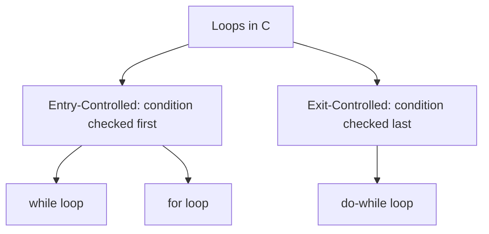

# Course: Data Structures Using C Programming (23CYUC101)
## UNIT - II: Control Flow, Arrays, Functions, Pointers & Structures (12 Hours)

---

## 1. Control Statements

Control statements control the flow of execution of program statements based on conditions. They are classified into:
1.  **Decision-Making/Selection Statements** (`if`, `if-else`, `switch-case`)
2.  **Looping/Iterative Statements** (`for`, `while`, `do-while`)
3.  **Jump Statements** (`break`, `continue`, `goto`, `return`)

---

### 1.1 Decision-Making Statements

#### 1. `if` and `if-else` Statement
Executes a block of code if a condition is true. The `if-else` provides an alternative block if the condition is false.
```c
if (condition) {
    // executes if condition is true
} else {
    // executes if condition is false
}
```

#### 2. Nested `if-else` & `if-else-if` Ladder
Used when there are multiple conditions to check.
```c
if (condition1) {
    // executes when condition1 is true
} else if (condition2) {
    // executes when condition2 is true
} else {
    // executes when all conditions are false
}
```

#### 3. `switch-case` Statement
A multi-way branching statement that compares a variable's value against multiple constant cases.
```c
#include <stdio.h>

int main() {
    int choice = 2;
    switch(choice) {
        case 1:
            printf("Choice is 1\n");
            break;
        case 2:
            printf("Choice is 2\n");
            break; // Prevents fall-through to subsequent cases
        default:
            printf("Invalid Choice\n");
    }
    return 0;
}
```

> [!IMPORTANT]
> The expression inside a `switch` statement must evaluate to an **integer** or **character** constant. Floats/doubles are NOT allowed.

---

### 1.2 Looping Statements

Loops allow repeating a block of statements until a specific condition becomes false.



#### 1. `while` Loop (Entry-Controlled)
Repeats code as long as the condition remains true. The loop body might not execute at all if the condition starts off false.
```c
int i = 1;
while (i <= 5) {
    printf("%d ", i);
    i++;
}
```

#### 2. `for` Loop (Entry-Controlled)
Combines initialization, condition checking, and increment/decrement into a single line.
```c
for (initialization; condition; increment/decrement) {
    // Loop body
}
```

#### 3. `do-while` Loop (Exit-Controlled)
Similar to `while`, but the condition is evaluated at the end of the loop body. This guarantees the loop body executes **at least once**.
```c
int i = 6;
do {
    printf("%d ", i); // Prints 6, even though condition is false
    i++;
} while (i <= 5);
```

---

### 1.3 Jump Statements
- **`break`**: Exits the innermost loop or switch-case statement immediately.
- **`continue`**: Skips the remaining statements in the current iteration and jumps to the next loop iteration.
- **`goto`**: Transfers control to a labelled statement in the same function (not recommended as it makes code unstructured).

---

## 2. Arrays

An array is a collection of elements of the same data type stored in contiguous memory locations under a single variable name.

### 2.1 One-Dimensional (1D) Arrays
Stores a single row of elements.
- **Declaration**: `int mark[5];` (Allocates space for 5 integers: `mark[0]` to `mark[4]`).
- **Initialization**: `int mark[5] = {90, 85, 95, 70, 80};`

#### Accessing elements:
```c
#include <stdio.h>

int main() {
    int arr[3] = {10, 20, 30};
    for (int i = 0; i < 3; i++) {
        printf("Index %d: Value = %d\n", i, arr[i]);
    }
    return 0;
}
```

---

### 2.2 Two-Dimensional (2D) Arrays
Represents data in a grid (matrix) format consisting of rows and columns.
- **Declaration**: `int matrix[2][3];` (2 rows and 3 columns).
- **Initialization**:
  ```c
  int matrix[2][3] = {
      {1, 2, 3}, // Row 0
      {4, 5, 6}  // Row 1
  };
  ```

---

## 3. Strings

A string is a character array terminated by a special null character `'\0'`.

### 3.1 Declaration & Initialization
```c
char str1[] = "Hello"; // Compiler automatically appends '\0' at the end
char str2[6] = {'H', 'e', 'l', 'l', 'o', '\0'};
```

### 3.2 Standard String Library Functions (`<string.h>`)
- **`strlen(str)`**: Returns the number of characters in the string (excluding `'\0'`).
- **`strcpy(dest, src)`**: Copies the source string into the destination string.
- **`strcat(dest, src)`**: Appends (concatenates) the source string to the end of the destination.
- **`strcmp(str1, str2)`**: Compares two strings. Returns `0` if equal, negative if `str1 < str2`, and positive if `str1 > str2`.

---

## 4. Built-in Functions

Built-in functions are pre-written library functions in header files that perform common operations.
- **Math Library (`<math.h>`)**: `sqrt(x)` (square root), `pow(x, y)` (x raised to y), `abs(x)` (absolute value), `ceil(x)`, `floor(x)`.
- **Character Test Library (`<ctype.h>`)**: `isalpha(c)` (check alphabet), `isdigit(c)`, `isupper(c)`, `tolower(c)`.

---

## 5. User-Defined Functions (UDF)

A function is a self-contained block of code that performs a specific task. Dividing code into functions promotes reusability and readability.

### 5.1 Function Structure
A function has three components:
1.  **Function Prototype (Declaration)**: Informs compiler about name, return type, and arguments.
2.  **Function Call**: Runs the function.
3.  **Function Definition**: The actual code block.

```c
#include <stdio.h>

// 1. Prototype Declaration
int getSquare(int n);

int main() {
    int x = 5;
    // 2. Function Call
    int res = getSquare(x);
    printf("Square of %d is %d\n", x, res);
    return 0;
}

// 3. Function Definition
int getSquare(int n) {
    return n * n;
}
```

---

### 5.2 Parameter Passing Methods
- **Call by Value**: Passing a copy of the actual argument. Changes inside the function do **not** affect the original variable.
- **Call by Reference**: Passing the address of the actual argument using pointers. Changes inside the function **will** affect the original variable.

```c
#include <stdio.h>

// Prototypes
void swapByValue(int a, int b);
void swapByReference(int *a, int *b);

int main() {
    int x = 10, y = 20;

    swapByValue(x, y);
    printf("After Swap By Value: x = %d, y = %d\n", x, y); // Outputs: x = 10, y = 20

    swapByReference(&x, &y);
    printf("After Swap By Reference: x = %d, y = %d\n", x, y); // Outputs: x = 20, y = 10

    return 0;
}

void swapByValue(int a, int b) {
    int temp = a;
    a = b;
    b = temp;
}

void swapByReference(int *a, int *b) {
    int temp = *a;
    *a = *b;
    *b = temp;
}
```

---

### 5.3 Recursion
Recursion is the process where a function calls itself directly or indirectly. It requires a **Base Case** to stop recursion; otherwise, it causes infinite loops and Stack Overflow.

```c
#include <stdio.h>

// Factorial of n = n * Factorial(n-1)
int factorial(int n) {
    if (n == 0 || n == 1) return 1; // Base case
    return n * factorial(n - 1);    // Recursive call
}

int main() {
    printf("Factorial of 5: %d\n", factorial(5)); // Output: 120
    return 0;
}
```

---

## 6. Structures and Unions

### 6.1 Structures
A structure groups variables of different data types under one name.

```c
struct Employee {
    int id;
    char name[30];
    float salary;
};
```
- **Accessing Members**: Use the dot `.` operator (e.g., `emp1.id = 101;`).
- **Array of Structures**: Creating an array of struct items (e.g., `struct Employee list[100];`).

---

### 6.2 Unions
Unions are similar to structures, but all members share the **same memory location**. The size of a union is equal to the size of its largest member.

```c
union Demo {
    int i;
    float f;
    char c;
};
```

#### Key Differences: Structure vs Union

| Feature | Structure (`struct`) | Union (`union`) |
| :--- | :--- | :--- |
| **Keyword** | `struct` | `union` |
| **Memory Allocation**| Every member gets its own unique memory block. | All members share the same single memory block. |
| **Size** | Sum of sizes of all members (plus padding). | Size of the largest member. |
| **Access** | You can access multiple members at the same time. | Only one member can contain a valid value at a time. |

---

## 7. Pointers

A pointer is a variable that stores the memory address of another variable.

### 7.1 Pointer Declaration & Initialization
```c
int val = 10;
int *ptr;     // Declaration
ptr = &val;   // Initialization (ptr stores the address of val)
```
- **Dereferencing (`*ptr`)**: Retrieves the value stored at the address pointer by `ptr`.

---

### 7.2 Pointer Arithmetic
You can perform arithmetic operations on pointers:
- **`ptr++`**: Increments address by `sizeof(data_type)`. If `ptr` is an integer pointer at memory `1000`, `ptr++` changes it to `1004` (since `int` takes 4 bytes).
- **`ptr--`**, **`ptr + n`**, **`ptr - n`**, **`ptr1 - ptr2`** are valid operations.
- *Note: You cannot add two pointers, multiply pointers, or divide them.*

---

### 7.3 Pointers and Arrays
The name of an array acts as a constant pointer to its first element.
```c
int arr[3] = {10, 20, 30};
int *p = arr; // Equivalent to p = &arr[0]

// Accessing array using pointer arithmetic
printf("%d\n", *(p + 0)); // prints arr[0] (10)
printf("%d\n", *(p + 1)); // prints arr[1] (20)
printf("%d\n", *(p + 2)); // prints arr[2] (30)
```
