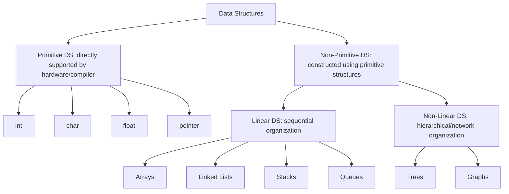
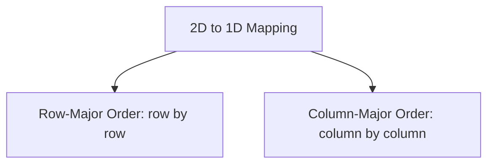

# Course: Data Structures Using C Programming (23CYUC101)
## UNIT - III: Algorithms, Data Structures & Arrays (12 Hours)

---

## 1. Introduction to Algorithms and Data Structures

### 1.1 Introduction to Data Structures
A **Data Structure** is a systematic way of organizing, managing, and storing data in a computer's memory so that operations can be performed efficiently. 

#### Why Do We Need Data Structures?
- **Data Search**: Finding a record in millions of elements (efficient search).
- **Processor Speed**: Managing high-speed processor execution on multiple tasks.
- **Multiple Requests**: Servicing concurrent data access requests from thousands of users.

---

### 1.2 Algorithms & Complexity Analysis
An algorithm is a step-by-step procedure to solve a computational problem.

#### Algorithm Analysis:
We evaluate algorithms based on their resource usage:
1.  **Time Complexity**: The amount of computer time an algorithm takes to run as a function of the input size $n$.
2.  **Space Complexity**: The amount of memory space required by the algorithm to run to completion.

#### Big-O Notation ($O$):
Used to describe the upper bound (worst-case scenario) of an algorithm's running time or memory requirements.

| Complexity | Name | Example Algorithm |
| :--- | :--- | :--- |
| $O(1)$ | Constant Time | Accessing an array element by index |
| $O(\log n)$ | Logarithmic Time | Binary Search |
| $O(n)$ | Linear Time | Linear Search |
| $O(n \log n)$ | Linearithmic | Merge Sort, Quick Sort |
| $O(n^2)$ | Quadratic Time | Bubble Sort, Selection Sort |

---

### 1.3 Classification of Data Structures



---

### 1.4 Data Structure Operations
The following operations are performed on any data structure:
- **Traversal**: Accessing each element of the structure exactly once for processing.
- **Search**: Finding the location of an element containing a given key value.
- **Insertion**: Adding a new element to the structure.
- **Deletion**: Removing an existing element from the structure.
- **Sorting**: Arranging elements in a specific logical order (ascending or descending).
- **Merging**: Combining elements from two different structures into a single sorted structure.

---

## 2. One-Dimensional (1D) Arrays in Memory

An array is a linear structure where elements are stored in contiguous memory locations.

### 2.1 Address Calculation Formula
Since memory is contiguous, we can calculate the exact address of any element $A[i]$ in constant $O(1)$ time.

$$\text{Address}(A[i]) = \text{Base Address} + (i - \text{Lower Bound}) \times \text{Size of Element } (W)$$

- **Base Address (BA)**: The starting memory address of the array (address of the first element).
- **Lower Bound (LB)**: The index of the first element of the array (typically `0` in C).
- **Size of Element ($W$)**: The number of bytes occupied by a single element (e.g., `sizeof(int)` = 4).

#### Numerical Example:
An integer array starts at Base Address `1000`. The elements are indexed from `0` to `9`. Find the address of `A[5]`.
- $BA = 1000$, $LB = 0$, $i = 5$, $W = 4$ bytes (integer).
- $\text{Address}(A[5]) = 1000 + (5 - 0) \times 4 = 1000 + 20 = 1020$.

---

### 2.2 Array Traversal
Visiting every element of an array from first to last.

```c
#include <stdio.h>

void traverse(int arr[], int n) {
    for (int i = 0; i < n; i++) {
        printf("%d ", arr[i]);
    }
    printf("\n");
}
```

---

### 2.3 Insertion in an Array
To insert an element at a specific index, all subsequent elements must be shifted to the right to make room.

```c
#include <stdio.h>

// Insert element val at index pos in an array of size n
void insert(int arr[], int *n, int val, int pos) {
    // Shift elements to the right
    for (int i = *n; i > pos; i--) {
        arr[i] = arr[i - 1];
    }
    arr[pos] = val; // Place new element
    (*n)++;         // Increase array size
}
```

---

### 2.4 Deletion from an Array
To delete an element at a specific index, all subsequent elements must be shifted to the left to close the gap.

```c
#include <stdio.h>

// Delete element at index pos in an array of size n
void deleteElement(int arr[], int *n, int pos) {
    // Shift elements to the left
    for (int i = pos; i < *n - 1; i++) {
        arr[i] = arr[i + 1];
    }
    (*n)--; // Decrease array size
}
```

---

## 3. Searching Algorithms

### 3.1 Linear Search (Sequential Search)
Compares the target value sequentially with every element of the array until a match is found.
- **Time Complexity**: $O(n)$ worst case, $O(1)$ best case.
- **Space Complexity**: $O(1)$.

```c
int linearSearch(int arr[], int n, int key) {
    for (int i = 0; i < n; i++) {
        if (arr[i] == key) return i; // Found, return index
    }
    return -1; // Not found
}
```

---

### 3.2 Binary Search
Used only on **sorted arrays**. It repeatedly divides the search interval in half.
- **Time Complexity**: $O(\log n)$ worst case, $O(1)$ best case.
- **Space Complexity**: $O(1)$.

```c
int binarySearch(int arr[], int n, int key) {
    int low = 0, high = n - 1;
    while (low <= high) {
        int mid = low + (high - low) / 2; // Prevents overflow

        if (arr[mid] == key) return mid;       // Key found
        else if (arr[mid] < key) low = mid + 1; // Search right half
        else high = mid - 1;                    // Search left half
    }
    return -1; // Not found
}
```

---

## 4. Sorting Algorithms

### 4.1 Bubble Sort
Repeatedly steps through the list, compares adjacent elements, and swaps them if they are in the wrong order. Small values "bubble" up.
- **Time Complexity**: $O(n^2)$ worst and average case, $O(n)$ best case (if optimized).

```c
void bubbleSort(int arr[], int n) {
    for (int i = 0; i < n - 1; i++) {
        int swapped = 0;
        for (int j = 0; j < n - i - 1; j++) {
            if (arr[j] > arr[j + 1]) {
                int temp = arr[j];
                arr[j] = arr[j + 1];
                arr[j + 1] = temp;
                swapped = 1;
            }
        }
        if (!swapped) break; // Array is already sorted
    }
}
```

---

### 4.2 Selection Sort
Divides the array into sorted and unsorted parts. Repeatedly finds the minimum element from the unsorted part and swaps it with the first unsorted element.
- **Time Complexity**: $O(n^2)$ in all cases.

```c
void selectionSort(int arr[], int n) {
    for (int i = 0; i < n - 1; i++) {
        int min_idx = i;
        for (int j = i + 1; j < n; j++) {
            if (arr[j] < arr[min_idx]) {
                min_idx = j;
            }
        }
        // Swap min element with current element
        int temp = arr[min_idx];
        arr[min_idx] = arr[i];
        arr[i] = temp;
    }
}
```

---

### 4.3 Insertion Sort
Builds the final sorted array one item at a time. It picks elements from the unsorted part and inserts them at their correct location in the sorted part.
- **Time Complexity**: $O(n^2)$ worst/average case, $O(n)$ best case.

```c
void insertionSort(int arr[], int n) {
    for (int i = 1; i < n; i++) {
        int key = arr[i];
        int j = i - 1;
        // Shift elements that are greater than key
        while (j >= 0 && arr[j] > key) {
            arr[j + 1] = arr[j];
            j--;
        }
        arr[j + 1] = key;
    }
}
```

---

## 5. Multi-Dimensional Arrays in Memory

Computers store 2D/3D arrays in linear 1D memory. There are two standard formats to translate 2D coordinates into linear addresses:



---

### 5.1 Row-Major Order (RMO)
Elements are stored row-by-row consecutively. Most compilers (including C/C++) use Row-Major Order.

#### Address Calculation Formula:
For a 2D Array $A[M][N]$ ($M$ rows, $N$ columns) starting at Base Address $BA$, with element size $W$:

$$\text{Address}(A[i][j]) = BA + [ (i - LR) \times N + (j - LC) ] \times W$$

- $LR$: Lower bound of row index (typically 0).
- $LC$: Lower bound of column index (typically 0).
- $N$: Number of columns.

#### Numerical Example:
Given $A[10][20]$ of type double ($W = 8$ bytes) with $BA = 2000$. Find the address of $A[3][5]$.
- $BA = 2000$, $i = 3$, $j = 5$, $N = 20$, $LR = 0$, $LC = 0$, $W = 8$.
- $\text{Address}(A[3][5]) = 2000 + [ (3 - 0) \times 20 + (5 - 0) ] \times 8 = 2000 + [60 + 5] \times 8 = 2000 + 65 \times 8 = 2000 + 520 = 2520$.

---

### 5.2 Column-Major Order (CMO)
Elements are stored column-by-column consecutively (used in languages like Fortran).

#### Address Calculation Formula:
$$\text{Address}(A[i][j]) = BA + [ (j - LC) \times M + (i - LR) ] \times W$$

- $M$: Number of rows.

#### Numerical Example (same values as above):
Find address of $A[3][5]$ in $A[10][20]$ ($M = 10$ rows, $N = 20$ columns) using CMO.
- $\text{Address}(A[3][5]) = 2000 + [ (5 - 0) \times 10 + (3 - 0) ] \times 8 = 2000 + [50 + 3] \times 8 = 2000 + 53 \times 8 = 2000 + 424 = 2424$.

---

## 6. Matrix Operations in C

A matrix can be represented in C using 2D arrays. Below are implementations of common operations:

### 6.1 Matrix Addition
```c
#include <stdio.h>

void addMatrices(int r, int c, int A[r][c], int B[r][c], int C[r][c]) {
    for (int i = 0; i < r; i++) {
        for (int j = 0; j < c; j++) {
            C[i][j] = A[i][j] + B[i][j];
        }
    }
}
```

---

### 6.2 Matrix Multiplication
To multiply two matrices, the number of columns in the first matrix must equal the number of rows in the second matrix.
- Dimensions: $A[r1][c1] \times B[r2][c2] = C[r1][c2]$ (where $c1 == r2$).

```c
#include <stdio.h>

void multiplyMatrices(int r1, int c1, int r2, int c2, int A[r1][c1], int B[r2][c2], int C[r1][c2]) {
    // Initialize result matrix with zero
    for (int i = 0; i < r1; i++) {
        for (int j = 0; j < c2; j++) {
            C[i][j] = 0;
            for (int k = 0; k < c1; k++) {
                C[i][j] += A[i][k] * B[k][j];
            }
        }
    }
}
```

---

### 6.3 Matrix Transpose
Swapping rows and columns of a matrix. Element $A[i][j]$ becomes $T[j][i]$.

```c
#include <stdio.h>

void transposeMatrix(int r, int c, int A[r][c], int T[c][r]) {
    for (int i = 0; i < r; i++) {
        for (int j = 0; j < c; j++) {
            T[j][i] = A[i][j];
        }
    }
}
```
