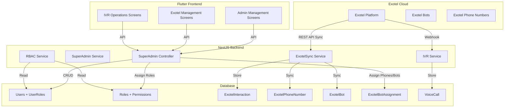

# SuperAdmin → Admin Management, IVR Data Sync & Exotel Bot Assignment

The Exotel dashboard shows full interaction data (audio files, transcripts, bot conversations) but the SuperAdmin panel in our system is missing:
1. **Audio files, transcripts, and Exotel bot conversation data** — the data is captured by `handleBotSessionEnd` in [`ivr.service.ts`](file:///c:/Users/DELL/Desktop/ivr_system_sengotics/src/ivr/ivr.service.ts) and stored in `VoiceCall` + `IvrCall` tables, but the SuperAdmin UI (Flutter) does not surface it with full Exotel-parity detail.
2. **SuperAdmin assigning phone numbers and bots to admins/org units** — there's no endpoint or UI for the SuperAdmin to assign an Exotel phone number or bot to an admin/org unit.
3. **SuperAdmin creating admins with granular role & permission control** — currently `createPanchayatAdmin` and `createStaffUser` create users with hardcoded roles (`panchayat_admin`, `agent`, `electrician`). There's no UI for the SuperAdmin to assign RBAC roles, set permissions per admin, or control what each created admin can see/do.

---

## User Review Required

> [!IMPORTANT]
> **Exotel API Integration**: The plan assumes we will use the Exotel REST API (with `EXOTEL_API_KEY` + `EXOTEL_API_TOKEN` already in `.env`) to pull interaction history, bot details, and phone number inventory. Please confirm you have an active Exotel account with API access enabled.

> [!IMPORTANT]
> **Bot Assignment Scope**: Are Exotel bots created and managed entirely in the Exotel dashboard, and we only need to *map* (assign) a bot ID + phone number to an org unit/admin in our system? Or do you also want to create/configure bots from the SuperAdmin panel?

> [!WARNING]
> **Breaking Change — User Creation Flow**: The current `POST /api/superadmin/users` creates a `panchayat_admin` with no RBAC role assignment. The new flow will require a `role_id` (from the RBAC `roles` table) and will create a `UserRole` entry. Existing admins created the old way will need a migration to backfill their `UserRole` records.

---

## Open Questions

> [!IMPORTANT]
> 1. **Exotel Bot-to-OrgUnit mapping**: Should one Exotel bot + phone number be assigned to **one org unit** (1:1), or can multiple org units share the same bot/number?
> 2. **Permission granularity**: What specific permissions should SuperAdmin control per admin? Options:
>    - Module-level access (e.g., IVR, Complaints, Tenders, Reports)
>    - Action-level access (e.g., can create complaints, can view audio, can export data)
>    - Data-scope access (e.g., own org unit only, all org units, specific wards)
> 3. **Exotel Sync Strategy**: Should we pull Exotel data on-demand (when SuperAdmin views the page), or run a background sync (cron) to keep local data in sync?

---

## Proposed Changes

### Component 1: Database Schema — New Models & Fields

#### [MODIFY] [`schema.prisma`](file:///c:/Users/DELL/Desktop/ivr_system_sengotics/prisma/schema.prisma)

**1a. New `ExotelPhoneNumber` model** — tracks Exotel phone numbers available in the system:
```prisma
model ExotelPhoneNumber {
  id              Int       @id @default(autoincrement())
  phone_number    String    @unique    // E.164 format
  friendly_name   String?              // "Mettupalayam IVR Line"
  exotel_sid      String?   @unique    // Exotel's internal SID
  is_active       Boolean   @default(true)
  assigned_org_id Int?                 // Which org unit this number is assigned to
  assigned_at     DateTime?
  assigned_by     Int?                 // SuperAdmin user ID
  created_at      DateTime  @default(now())
  updated_at      DateTime  @updatedAt

  assigned_org    OrgUnit?  @relation("OrgUnitExotelPhone", fields: [assigned_org_id], references: [id])
  assigned_by_user User?   @relation("PhoneAssignedBy", fields: [assigned_by], references: [id])
  bot_assignments  ExotelBotAssignment[]

  @@map("exotel_phone_numbers")
}
```

**1b. New `ExotelBot` model** — tracks Exotel AI voicebots:
```prisma
model ExotelBot {
  id              Int       @id @default(autoincrement())
  bot_id          String    @unique    // Exotel bot ID
  bot_name        String                // "Mettupalayam Complaint Bot"
  bot_version     String?               // "v11"
  description     String?
  is_active       Boolean   @default(true)
  created_at      DateTime  @default(now())
  updated_at      DateTime  @updatedAt

  assignments     ExotelBotAssignment[]

  @@map("exotel_bots")
}
```

**1c. New `ExotelBotAssignment` model** — many-to-many mapping of bots + phone numbers to org units:
```prisma
model ExotelBotAssignment {
  id               Int       @id @default(autoincrement())
  bot_id           Int
  phone_number_id  Int
  org_unit_id      Int
  assigned_by      Int                 // SuperAdmin user ID
  is_active        Boolean   @default(true)
  created_at       DateTime  @default(now())

  bot          ExotelBot         @relation(fields: [bot_id], references: [id])
  phone_number ExotelPhoneNumber @relation(fields: [phone_number_id], references: [id])
  org_unit     OrgUnit           @relation(fields: [org_unit_id], references: [id])

  @@unique([bot_id, phone_number_id, org_unit_id])
  @@map("exotel_bot_assignments")
}
```

**1d. New `ExotelInteraction` model** — stores full Exotel interaction data synced from the dashboard:
```prisma
model ExotelInteraction {
  id                Int       @id @default(autoincrement())
  interaction_id    String    @unique    // Exotel interaction UUID
  bot_id            String?              // Exotel bot ID
  call_sid          String?              // Links to VoiceCall/IvrCall
  customer_number   String?
  bot_name          String?
  bot_version       String?
  started_at        DateTime?
  ended_at          DateTime?
  duration_seconds  Int?
  audio_url         String?              // Recording URL from Exotel
  transcript_json   Json?                // Full conversation transcript
  transcript_text   String?              // Flattened transcript text
  status            String?              // completed, failed, etc.
  metadata          Json?                // Raw Exotel payload
  synced_at         DateTime  @default(now())

  @@index([call_sid])
  @@index([bot_id])
  @@index([customer_number])
  @@map("exotel_interactions")
}
```

**1e. Add relations to `OrgUnit`**:
```prisma
// Add to OrgUnit model:
exotel_phones        ExotelPhoneNumber[] @relation("OrgUnitExotelPhone")
exotel_bot_assignments ExotelBotAssignment[]
```

**1f. Add relations to `User`**:
```prisma
// Add to User model:
phone_assignments ExotelPhoneNumber[] @relation("PhoneAssignedBy")
```

---

### Component 2: Exotel Sync Service — Pull Data from Exotel API

#### [NEW] [`src/ivr/exotel-sync.service.ts`](file:///c:/Users/DELL/Desktop/ivr_system_sengotics/src/ivr/exotel-sync.service.ts)

A service that:
- **Fetches interaction history** from Exotel's REST API (`GET /v2/accounts/{sid}/call-details` and bot interaction endpoints)
- **Syncs phone numbers** available on the Exotel account
- **Syncs bot list** from Exotel
- **Stores audio URLs and full transcripts** into `ExotelInteraction` table
- **Links interactions to existing `VoiceCall`/`IvrCall` records** via `call_sid`
- Uses `EXOTEL_API_KEY` and `EXOTEL_API_TOKEN` from env (already configured)

Key methods:
```typescript
class ExotelSyncService {
  async syncInteractionHistory(dateFrom?: Date, dateTo?: Date): Promise<SyncResult>
  async syncPhoneNumbers(): Promise<ExotelPhoneNumber[]>
  async syncBots(): Promise<ExotelBot[]>
  async getInteractionDetail(interactionId: string): Promise<ExotelInteraction>
  async getAudioForInteraction(interactionId: string): Promise<Buffer>
}
```

---

### Component 3: SuperAdmin — Admin Creation with RBAC

#### [MODIFY] [`src/super-admin/super-admin.controller.ts`](file:///c:/Users/DELL/Desktop/ivr_system_sengotics/src/super-admin/super-admin.controller.ts)

Add new endpoints:

| Method | Path | Purpose |
|--------|------|---------|
| `POST` | `/api/superadmin/admins` | Create admin with full RBAC role assignment |
| `GET` | `/api/superadmin/admins` | List all admins with their roles, permissions, assigned org units |
| `GET` | `/api/superadmin/admins/:id` | Get admin detail with full permission breakdown |
| `PUT` | `/api/superadmin/admins/:id` | Update admin (change role, permissions, org unit, status) |
| `PATCH` | `/api/superadmin/admins/:id/roles` | Assign/revoke RBAC roles for an admin |
| `PATCH` | `/api/superadmin/admins/:id/permissions` | Override specific permissions for an admin |
| `PATCH` | `/api/superadmin/admins/:id/status` | Activate/deactivate/lock an admin |
| `GET` | `/api/superadmin/roles` | List all available RBAC roles (for dropdown in create form) |
| `GET` | `/api/superadmin/permissions` | List all available permissions (for permission matrix UI) |

**New `POST /api/superadmin/admins` request body:**
```typescript
{
  email: string;
  password: string;
  phone_e164?: string;
  name?: string;
  org_unit_id: number;          // Primary org unit
  role_ids: number[];           // RBAC roles to assign
  permission_overrides?: {      // Optional per-permission overrides
    grant: string[];            // Permission codes to explicitly grant
    deny: string[];             // Permission codes to explicitly deny
  };
  access_scope?: string;        // "own_org_unit" | "child_org_units" | "all_org_units"
  is_temporary?: boolean;       // Temporary access
  valid_until?: string;         // ISO date for temp access expiry
}
```

#### [MODIFY] [`src/super-admin/super-admin.service.ts`](file:///c:/Users/DELL/Desktop/ivr_system_sengotics/src/super-admin/super-admin.service.ts)

Add service methods for the new admin management flow:
- `createAdminWithRoles()` — creates User + UserRole entries in a transaction
- `updateAdminRoles()` — updates UserRole entries (add/remove roles)
- `getAdminDetail()` — returns user with resolved entitlements (uses `RbacService.entitlementsFor()`)
- `listAdminsWithRoles()` — enriched user list with RBAC detail
- `toggleAdminStatus()` — activate/deactivate/lock

---

### Component 4: SuperAdmin — Phone Number & Bot Assignment

#### [MODIFY] [`src/super-admin/super-admin.controller.ts`](file:///c:/Users/DELL/Desktop/ivr_system_sengotics/src/super-admin/super-admin.controller.ts)

Add new endpoints:

| Method | Path | Purpose |
|--------|------|---------|
| `GET` | `/api/superadmin/exotel/phone-numbers` | List Exotel phone numbers (synced + assigned) |
| `POST` | `/api/superadmin/exotel/phone-numbers/sync` | Trigger sync from Exotel API |
| `PATCH` | `/api/superadmin/exotel/phone-numbers/:id/assign` | Assign phone number to org unit |
| `GET` | `/api/superadmin/exotel/bots` | List Exotel bots (synced) |
| `POST` | `/api/superadmin/exotel/bots/sync` | Trigger sync from Exotel API |
| `POST` | `/api/superadmin/exotel/assignments` | Assign bot + phone to org unit |
| `DELETE` | `/api/superadmin/exotel/assignments/:id` | Remove bot assignment |
| `GET` | `/api/superadmin/exotel/assignments` | List all bot-phone-orgunit assignments |

---

### Component 5: SuperAdmin — Full Exotel Interaction History & Audio

#### [MODIFY] [`src/super-admin/super-admin.controller.ts`](file:///c:/Users/DELL/Desktop/ivr_system_sengotics/src/super-admin/super-admin.controller.ts)

Add new endpoints:

| Method | Path | Purpose |
|--------|------|---------|
| `GET` | `/api/superadmin/exotel/interactions` | List all Exotel interactions with filters (date, bot, phone, status) |
| `GET` | `/api/superadmin/exotel/interactions/:id` | Full interaction detail (audio URL, transcript, metadata) |
| `GET` | `/api/superadmin/exotel/interactions/:id/audio` | Audio proxy (same pattern as existing `audio-proxy`) |
| `POST` | `/api/superadmin/exotel/interactions/sync` | Trigger sync from Exotel for date range |
| `GET` | `/api/superadmin/exotel/dashboard` | Exotel summary stats (total calls, by bot, by phone number, by org unit) |

#### [MODIFY] existing `GET /api/superadmin/voice-calls` endpoint

Enhance the existing [`listVoiceCalls`](file:///c:/Users/DELL/Desktop/ivr_system_sengotics/src/super-admin/super-admin.service.ts#L961-L1050) to also join `ExotelInteraction` data when available, so that audio URLs and transcripts that were synced from Exotel are visible alongside locally-captured data.

---

### Component 6: Flutter Frontend — SuperAdmin Screens

#### [NEW] `ivr_frontend/lib/features/modules/admin_management/`

New feature module with screens:

| Screen | Purpose |
|--------|---------|
| `admin_list_screen.dart` | List all admins with role badges, org unit, status, actions |
| `admin_create_screen.dart` | Form: email, password, org unit picker, role multi-select, permission matrix toggle |
| `admin_detail_screen.dart` | View admin with full permission breakdown, assigned phone/bot, activity log |
| `admin_roles_editor.dart` | Widget: role assignment with permission preview |

#### [NEW] `ivr_frontend/lib/features/modules/exotel_management/`

New feature module with screens:

| Screen | Purpose |
|--------|---------|
| `exotel_dashboard_screen.dart` | Summary cards (total calls, active bots, assigned phones) + interaction list |
| `phone_assignment_screen.dart` | Drag-and-drop or dropdown to assign phone numbers to org units |
| `bot_assignment_screen.dart` | Assign bots + phones to org units with config |
| `interaction_detail_screen.dart` | Full interaction view: audio player, transcript viewer, metadata panel |

#### [MODIFY] `ivr_frontend/lib/features/modules/ivr_operations/`

Enhance existing IVR operations screens:
- Add audio player widget that uses the audio proxy endpoint
- Show full conversation transcript (not just raw text)
- Link to Exotel interaction detail when available

---

### Component 7: RBAC Seed Updates

#### [MODIFY] [`prisma/seed-rbac.js`](file:///c:/Users/DELL/Desktop/ivr_system_sengotics/prisma/seed-rbac.js)

Add new AppScreen entries:
- `admin_management` — "Admin Management" screen for SuperAdmin
- `exotel_management` — "Exotel Configuration" screen for SuperAdmin

Add new Permissions:
- `admins.create`, `admins.read`, `admins.update`, `admins.delete`
- `admins.assign_roles`, `admins.manage_permissions`
- `exotel.view_interactions`, `exotel.sync_data`
- `exotel.assign_phones`, `exotel.assign_bots`

---

## Architecture Diagram



---

## Verification Plan

### Automated Tests
```bash
# Run existing test suite to ensure no regressions
npm run test

# Run RBAC-specific tests
npm run test -- --grep "rbac"

# Verify Prisma schema compiles
npx prisma validate

# Generate Prisma client after schema changes
npx prisma generate

# Run migration
npx prisma migrate dev --name add-exotel-admin-management
```

### Manual Verification
1. **SuperAdmin creates an admin**: Login as super_admin → Admin Management → Create Admin → Select org unit, assign roles → Verify user appears in list with correct permissions
2. **Phone number assignment**: Exotel Management → Sync Phone Numbers → Assign to org unit → Verify IVR calls to that number route correctly
3. **Bot assignment**: Exotel Management → Sync Bots → Assign bot + phone to org unit → Verify bot interactions appear under that org unit
4. **Interaction history**: Exotel Management → View Interactions → Play audio → Verify transcript matches Exotel dashboard
5. **Permission enforcement**: Login as created admin → Verify only permitted screens/actions are accessible
6. **Role modification**: SuperAdmin changes admin's role → Admin's sidebar and permissions update on next login
